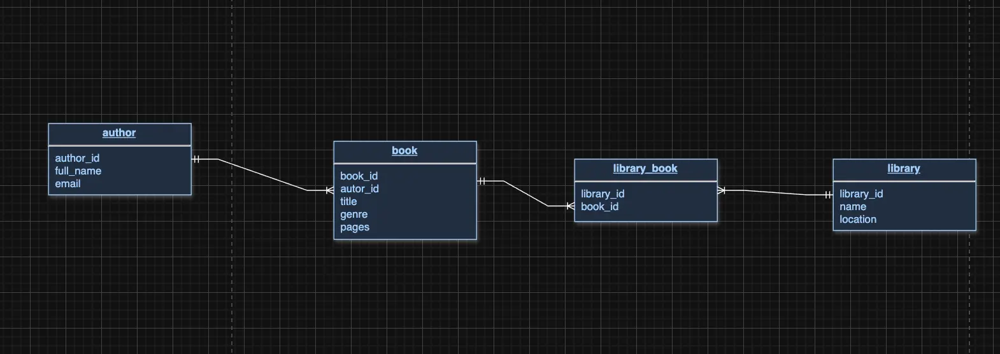

# 📚 Hibernate Library System
*A Java-based ORM challenge using Hibernate to manage authors, books, and libraries in a PostgreSQL database.*

---

## 🖼️ Project Architecture



> *Entity Relationship Diagram: Author ↔ Book ↔ Library via `library_book`*

---


## ✨ Introduction

This project is a personal milestone achieved after completing my deep dive into Hibernate ORM. It demonstrates a full-fledged relational system where:
- Authors write Books
- Books belong to multiple Libraries (many-to-many)
- Hibernate manages all entities with bi-directional associations, lazy loading, and caching

I built this to solidify my understanding of entity relationships, session management, and query execution using HQL.

---

## 🛠️ Installation & Setup

1. **Clone the repository**
   ```bash
   git clone https://github.com/SpizhovyiMaxDev/Hibernate-Library-System.git
   cd Hibernate-Library-System
